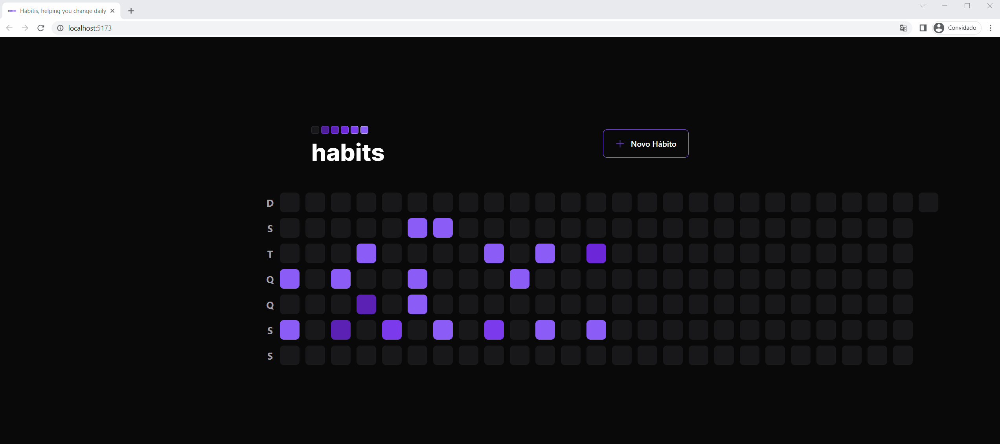

# 🌟 HabitToolFrontend
A studying frontend project developed during the @Rocketset Ignite event.

## 📜 Description
HabitToolFrontend is the user interface of the HabitTool application, a system for tracking and maintaining a record of daily habits. This repository contains the frontend source code of the application.

## ✨ Features
- Daily habit tracking
- Progress visualization of habits
- Goal setting and reminders
- Interface customization

## ⚙️ Prerequisites
- Node.js (version X.X.X)
- npm (Node.js package manager)

## 🚀 Installation
1. Clone the repository to your local environment:
git clone https://github.com/RomuloRamos/HabitToolFrontend.git
2. Navigate to the project directory:
cd HabitToolFrontend
3. Install the dependencies:
npm install
4. Start the application:
npm run dev
5. Access the application in your browser at `http://localhost:5173`

## 💡 Usage

- Add daily habits that you want to track.
- Mark the habits as completed every day.
- Track your progress and view statistics of your habits.

## 🤝 Contribution
Contributions are welcome! Feel free to submit pull requests with improvements, bug fixes, or new features. To contribute to the project, follow these steps:
1. Fork the repository.
2. Create a new branch for your changes: `git checkout -b my-feature`
3. Make the desired changes and commit.
4. Push your changes to your fork: `git push origin my-feature`
5. Submit a pull request on GitHub.

## 📄 License
This project is licensed under the [MIT License](https://opensource.org/licenses/MIT).

## ✍️ Author
- Name: Rômulo Ramos
- Email: romulo.ramos@gee.inatel.br

## 📝 Additional Notes
- For more information about the HabitTool backend, see the [HabitToolServer repository](https://github.com/RomuloRamos/HabitToolServer).
- Check out the mobile version of this project as well, see the [HabitToolMobile repository](https://github.com/RomuloRamos/HabitToolMobile).
- To report issues or request new features, create an issue in this repository.
